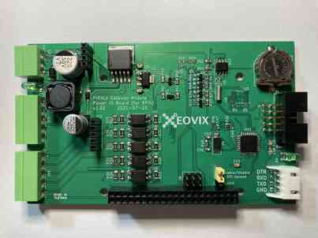
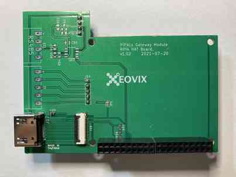
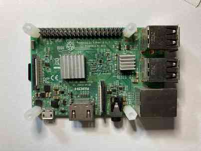
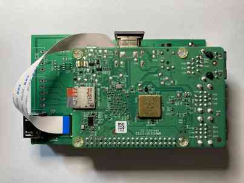

# PiPAL COMBOS (Combo Shield)

An **[ALL IN ONE]** combo shield of Raspberry Pi for the field of home automatic and industry control.
Download and Program the different image to SD Card, then make **PiPAL COMBOS** to be a Gateway, Production line Dashboard, PLC, AOI (Automatic Optical Inspection, Machine Vision), Data Collector, CNC Controllor and so on in just 10 minutes.

### **Overview** 

The **PiPAL-COMBOS** is a series of HATs (Hardware Attached on Top) for All Raspberry Pi modules, which offers RS232/RS485, Digital IO, Analog Input, USB, Ethernet to integrate a Platform for home automatic and industry control.

**PiPAL-COMBOS** is a combination system, the simple system architecture is as pic-1. 

The hardware is combined by three major boards, the bottom board is called **'Power and DIO'** board, the middle board is called **'Bridge and Extend Interface'** board, then the upper board is Raspberry Pi module. (as pic-2)

For supporting the different Raspberry Pi Module, **PiPAL-COMBOS** has two models.

The Model A supports Raspberry Pi 3+ and Raspberry Pi 4/4+. see pic-3, pic-4 and pic-5. Then combined as pic-6.

pic-3 : Model  A - Power and DIO board

pic-4: Model A -Bridge and Extend Interface

pic-5: Raspberry Pi 3+                                            

pic-6: The combined platform of Model A.

The Model B supports Raspberry Pi Zero and Raspberry Pi Computing Module 4. see pic-7, pic-8 and pic-9. 
Then combined as pic-10.

pic-7 : Model B - Power and DIO board             
pic-8: Model B -Bridge and Extend Interface
pic-9: Raspberry Pi Zero         
pic-10: The combined platform of Model B.                                

For the Compute Module 4, we offer a new piggyback board. see pic-11.      

pic-11: new piggyback board.           

### **Compact Casing**
The final assembly of **PiPAL-COMBOS** is enclosing the PCB into the aluminum shell. The followed pictures are introducing the procedure. See pic-12 to pic-15.

pic-12 : Assemble all PCBs

pic-13 : Insert to the case by the bottom PCB follow the track.

pic-14 : To the end.

pic-15 : Place cover.

### **Interface and Connectors**
**Front side**
The front side of **PiPAL-COMBOS** is the user's interface, there are USB, RJ485 and a IDC (Insulation-displacement connector). see pic-16

**Reverse side**
The reverse side of **PiPAL-COMBOS** is the device's interface, there are Digital Input, Analog Input, Output and RS485 connectors. see pic-17

### **Input and Output channels**
The **PiPAL-COMBOS** has three 5-pin connectors for input and output. And they are 1 set of Analog Input, 1 set of Digital Input and 1 set of Output.

Each Analog input is a 10 bits ADC, means the resolution is 1024 grades. Since the Analog Volt Reference is connected to the DC Power source. The PSU (Power Supply Unit) is 12 Volt, so each grade is about 11.718 mV.

The Digital Inputs are all isolated, so each one of them can be connected with the sensor which driven by PSU directly. The 1st channel is an interrupt input. It can be used for the ES (Emergency Switch) input. Or, using it to be an Run-Time counter as the speed counter, it is easily to be initiated from the API of **PiPAL-COMBOS** library.

For the general usage in automatic controls and industry controls, the output channels of **PiPAL-COMBOS** are designed to offer the multi-functions, it can be a simple digital output and an analog output by PWM. It even can be a motor pulse control output. It's not like the simple PWM, the motor pulse control function will have the complete acceleration deceleration period for motor pulse. 
The Digital Outputs are all open collector. The max output voltage can be 50V. Users can connect the Relay directly with the PSU's power source. The channel 1, channel 3 and channel 4 are available to be set PWM mode, so user can use the API's function to drive the stepping motor or LED. The official firmware of the controller on IO board is multi-tasking, it means when the output pin has driven the motor, the other IO channels are available being read and wrote concurrently.    

Actually, the IO controller is Atmel Mega328, and the circuit hardware was designed to compatible with the Arduino UNO, so the user can use the Arduino IDE to make program by his own. Without any Raspberry Pi Module, the **PiPAL-COMBOS** can be worked alone as an Arduino UNO, and freely using the OpenPLC project to work as a PLC. Then when it collaborates with Raspberry Pi Module, the Mega328 can be programmed as an I2C slave to work with Raspberry Pi. 

### **Communication**

According to the purpose and necessity, user can install the different image on SD, then make **PiPAL-COMBOS** to be the different device for home automatic or industry control. The complete applications and drivers what we'd done such as Data Collector, AOI (Automatic Optical Inspection), Bar-code Scanner, Motor Controller, PLC, Security/Surveillance system, Gateway and so on. The user can download from here freely.

For the IoT and IIoT, we just work done the software for Gateway system. It includes an embedded HMI web server to offer the dashboard for each IO pins, and using browser application on smart phone to view it and control it remotely. It also support MQTT, OPC UA, MOD Bus and IIoT Cloud connectors, communicate with most any brand of PLC or other equipment by RS232/RS485, and securely transmit data to wherever it is required.

Install the AOI image to SD card, the **PiPAL-COMBOS** can be worked as a stand-alone Vision Inspecting System, programmable controller or a slave control module which connected by a host PC to manipulate to. Beyond the on-board I/O and RS485, it is also available to direct controlled by PLC.

Images of SD card for specified Raspberry Pi module

1. Vision system - Image Pattern Searching AOI system. (only support Model C and needs register on line for vision library )
2. Vision system - Image Pattern Matching AOI system. (only support Model C and needs register on line for vision library)
3. Security system - Face recognition.
4. Gateway system.
5. Data collector.
6. Motor controller.
7. I/O controller.
8. 

###  **General Specifications**

1. 1~2 10/100Base-T(X) Ethernet ports (Model B)
2. One (1) isolated RS-232 serial port  (Model A, B)
3. One (1) isolated RS-485 serial port  (Model A, B)
4. 5 Analog Input Pins.  (Model A, B)
5. 5 Digital Input Pins.  (Model A, B)
6. 5 Digital Output Pins.  (Model A, B)
7. 12-24 VDC +/- 15% 
8. Operating Temperature : normal type -10 to 65 C, industrial type -40 to 75 C 
9. Aluminum Housing.

### **Extend Module**

The Extend module is designed to support **PiPAL-COMBOS** when the local IO is insufficient.

Easilly connect the extend wire by the 10 pins IDC connector. The maximum length of extend wire is 10 meters, it should be enough for the general environment of home automatic and industry control. For a better communication, the twist and shielding wiring is recommended.

