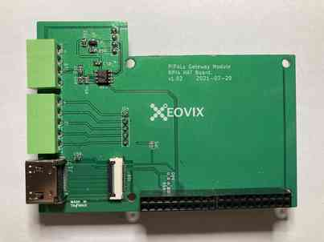
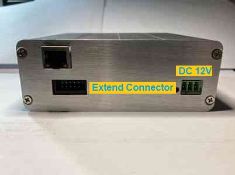

# PiPAL COMBOS (Combo Shield)

An **"ALL IN ONE"** combo shield of Raspberry Pi for the field of home automatic and industry control.

Download and Program the specific image to SD Card, then make **PiPAL COMBOS** to be an IIoT Gateway, Production line Dashboard, PLC, Security System, AOI (Automatic Optical Inspection, Machine Vision), Data Collector, CNC Controller and so on in just 10 minutes.

### **Overview** 

**PiPAL-COMBOS** is a series of HATs (Hardware Attached on Top) for All Raspberry Pi modules, which offers RS232/RS485, Digital IO, Analog Input, USB, Ethernet to integrate a Platform for home automatic and industry control.

**PiPAL-COMBOS** is a combination system, its hardware is combined by three major boards, the bottom board is called **'Power and DIO'** board, the middle board is called **'Bridge and Extend Interface'** board, then the upper board is Raspberry Pi module. (as pic-1 and pic-2)

 pic-1

 pic-2

### **Model A and Model B**
For supporting the different Raspberry Pi Module, **PiPAL-COMBOS** has two models.

The **Model A** supports Raspberry Pi 3+ and Raspberry Pi 4/4+. see pic-3, pic-4 and pic-5. Then combined as pic-6.

pic-3 : Model  A - Power and DIO board

pic-4: Model A -Bridge and Extend Interface

pic-5: Raspberry Pi 4+                                            

pic-6: The combined platform of Model A.

The **Model B** supports Raspberry Pi Zero and Raspberry Pi Computing Module 4. see pic-7, pic-8 and pic-9. 
Then combined as pic-10.

pic-7 : Model B - Power and DIO board             
pic-8: Model B -Bridge and Extend Interface
pic-9: Raspberry Pi Zero         
pic-10: The combined platform of Model B.                                

For the Compute Module 4, we offer a new piggyback board. see pic-11.      

pic-11: new piggyback board.           

### **Compact Casing**
The final assembly of **PiPAL-COMBOS** is enclosing the PCB into the aluminum shell. The followed pictures are introducing the procedure. See pic-12 to pic-15.

pic-12 : Assemble all PCBs

pic-13 : Insert to the case by the bottom PCB follow the track.

pic-14 : To the end.

pic-15 : Place cover.

### **Interface and Connectors**
**Front side** --
The front side of **PiPAL-COMBOS** is the user's interface, there are Ethernet, USB and an IDC (Insulation-displacement connector). see pic-16

 pic16 : front side

**Reverse side** --
The reverse side of **PiPAL-COMBOS** is the device's interface, there are Digital Input, Analog Input, Multi-Function Output and RS485 connectors. see pic-17

 pic17 : reverse side

### **Input and Output channels**
The **PiPAL-COMBOS** has three sets of 5-pin connectors for input and output. And they are one set of Analog Input, one set of Digital Input and one set of Multi-Function Output.

Each Analog input is a 10 bits ADC, means the resolution is 1024 grades. Since the Analog Volt Reference is connected to the DC Power source. The PSU (Power Supply Unit) is 12 Volt, so each grade is about 11.718 mV.

The Digital Inputs are all isolated at NPN mode, so each one of them can be connected with the sensor which driven by PSU directly. The 1st channl is an interrupt input. It can be used for the ES (Emergency Switch) input. Or, using it to be an Run-Time counter as the speed counter, it is easily to be initiated from the API of **PiPAL-COMBOS** library.

For the general usage in automatic controls and industry controls, the Output channels of **PiPAL-COMBOS** are designed to offer the Multiple Functions, the default is simple digital output. Use API (analog_write) to process the output as a PWM function. Use API (stepping_speed and stepping_pulse), it even can be a motor pulse control output. It's not like the simple PWM, the motor pulse control function will have the complete acceleration deceleration period for motor processing.

The Outputs are all open collector and actived Low mode. The maximum voltage is 50V. User can connect the Relay directly with the PSU's power source. The channel 1, channel 3 and channel 4 are available to be set PWM mode, so it can directly drive LED. The default firmware of the controller on IO board is multi-tasking, it means when the output pin has driven the motor, the other IO channels are available being read and wrote concurrently.    

Actually, the IO controller is Atmel Mega328, and the hardware was designed to compatible with the Arduino UNO, so the user can use the Arduino IDE to make program by his own. Without any Raspberry Pi Module, the **PiPAL-COMBOS** can be worked alone as an Arduino UNO, and freely using the OpenPLC project to work as a PLC. Then when it collaborates with Raspberry Pi Module, the Mega328 can be programmed as an I2C slave to work with Raspberry Pi. 

### **Communication**
For the acceptance of the most communication way with general industry devices, RS485 is the major on board serial interface. But **PiPAL-COMBOS** also reserves the TX and RX pins at Extend IDC connector. It needs plug in a RS232 Extend Board to complete a standard UART communication, or using the easy way of USB2RS232 dongle to reach it. 

### **Ready for Quick Usage by Loading the specific image to SD card**
According to the purpose and necessity, user can install the different image on SD, then make **PiPAL-COMBOS** to be the different device for home automatic or industry control. The complete applications and drivers what we'd done such as IIoT Gateway, CNC Controller, Data Collector, AOI (Automatic Optical Inspection), Barcode Scanner, Motor Controller, PLC, Security/Surveillance system and so on. The user can download from here freely.

Example 1:
For the IoT and IIoT Gateway, we just work done the software. It includes an embedded HMI web server to offer the dashboard for each IO pins, and using browser application on smart phone to view it and control it remotely. It also support MQTT, OPC UA, MOD Bus and IIoT Cloud connectors, communicate with most any brand of PLC or other equipment by RS232/RS485, and securely transmit data to wherever it is required.

When the **PiPAL-COMBOS** running as an IoT/IIoT Gateway, using a PC or a smart Phone, startup the browser then enter the **PiPAL-COMBOS**'s IP. Clicking or touching the indicators from browser, it is easy to control the **PiPAL-COMBOS** remotely. See the pic-18 and pic-19. For the system integrator, using the MQTT or OPC UA protocal to get the status or datas are also easily.

 pic18 : Screen grab from PC

 pic18 : display on the smart phone and PC.

Example 2:
Install the AOI image to SD card, the **PiPAL-COMBOS** can be worked as a stand-alone Vision Inspecting System, programmable controller or a slave control module which connected by a host PC to manipulate to. Beyond the on-board I/O and RS485, it is also available to direct controlled by PLC.

Images of SD card for specified Raspberry Pi module

1. Vision system - Image Pattern Searching AOI system. (only support Model B with CM4 piggyback and needs register on line for vision library )
2. Vision system - Image Pattern Matching AOI system. (only support Model B with CM4 piggyback and needs register on line for vision library)
3. Security system - Face recognition.
4. Gateway system.
5. Data collector.
6. Motor controller.
7. I/O controller.
8. 3 Axis CNC controllor (needs Extend Module)

### **Demonstration Videos**

1. IIoT Gateway

2. AOI System

3. Digital input, Analog input and Multi-Function output

###  **General Specifications**

1. 1~2 10/100Base-T(X) Ethernet ports (Model B)
2. One (1) isolated RS-232 serial port  (Model A, B)
3. One (1) isolated RS-485 serial port  (Model A, B)
4. 5 Analog Input Pins.  (Model A, B)
5. 5 Digital Input Pins.  (Model A, B)
6. 5 Multi-Function Output Pins.  (Model A, B)
7. 12-24 VDC +/- 15% 
8. Operating Temperature : normal type -10 to 65 C, industrial type -40 to 75 C 
9. Aluminum Housing.

### **Extend Module**

The Extend module is designed to support **PiPAL-COMBOS** when the local IO is insufficient. see pic-20

 pic20 : Extend Module

**Front side** --
The front side of **Extend Module** is the upstream interface, there are Ethernet, DC Power an IDC (Insulation-displacement connector). see pic-21

 pic21 : front side of Extend Module

**Reverse side** --
The reverse side of **Extend Module** is the device's interface, there are Digital Input, Analog Input, Multi-Function Output. see pic-22

 pic22 : reverse side of Extend Module

Easilly connect the extend wire by the 10 pins IDC connector (see pic-23). The maximum length of extend wire is 10 meters, it should be enough for the general environment of home automatic and industry control. For a better communication, the twist and shielding wiring is recommended.

 pic23 : connection of PiPAL-COMBOS and Extend Module

